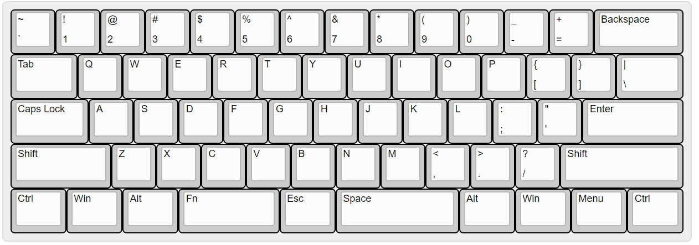
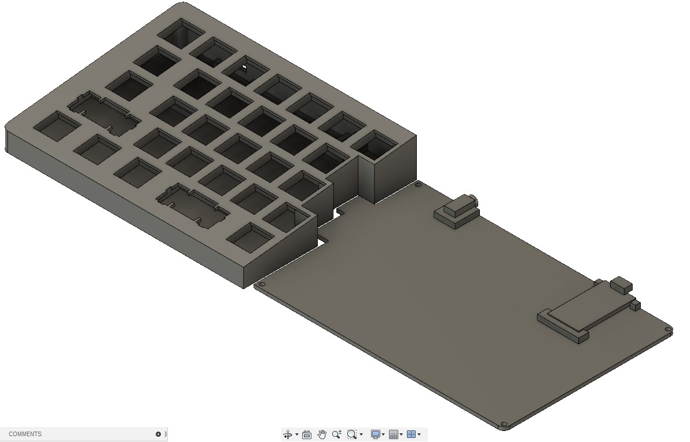

# split-keyboard-case-generator

Fusion 360 script that generates a set of 3-D printable split keyboard cases base on KLE json file.

# Example

## Input

[ks63.json](example/ks-63.json)

## Output

# Installation

1. Clone or download this repo onto your local folder
2. Fire up Fusion 360 and press `Shift + s` to bring up "Script and Add-Ins" dialog
3. Click on `+` sign of `My Scripts` and select your local repo folder
4. You should see a new sciprt named `keyboard-case-generator` is added

# Quick start

1. Go to http://www.keyboard-layout-editor.com/
2. Customize layout to your liking then download as JSON file
3. Fire up Fusion 360 and press `Shift + s` to bring up "Script and Add-Ins" dialog
4. Double click the script and select your downloaded json file
5. Wait for a while...

